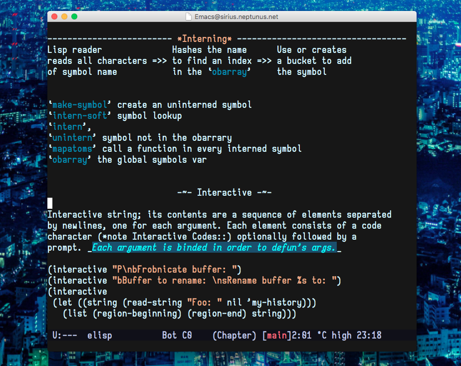
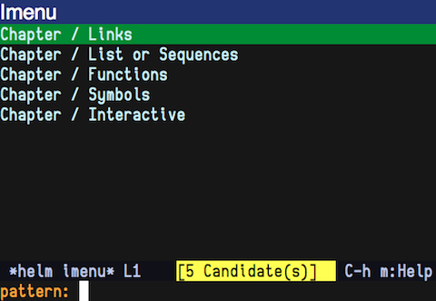
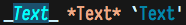

# Chapter Mode

A derivation of Emacs Fundamental Mode that allows editing plain text
files with some simple but nice extras.

<p align="center">
  
</p>

## Fast indexing

Sentences surrounded with `-~- The Chapter -~-` are indexed, for
convenience a keyboard binding is available `C-c m p` that centers and
promotes the text to the indexing matching format.


            *Example using helm-imenu.*

# Text highlight

Text between delimiters is highlighted like bellow



## Usage

In order for Emacs to automatically activate `chapter-mode` in a plain
text file a single line at the top of the file is all it takes.

```el
-*- Chapter -*-
```
## Installation

Add `chapter.el` directory to your load path in `init.el` and require it
with `(require 'chapter-mode)` done!

## License

Copyright © 2017 Pedro Major <pedro.major@gmail.com>
